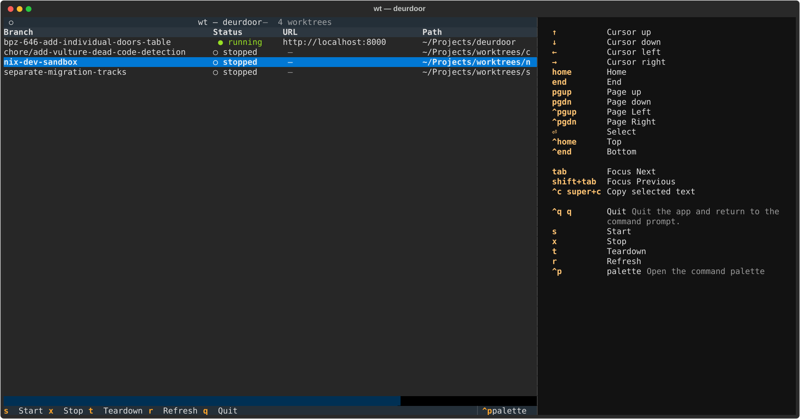

# wt — Worktree CLI Tool

A terminal UI for managing git worktrees alongside their docker compose stacks.



## Why

Working across many feature branches with heavy docker compose stacks (one backend + postgres + redis + pgadmin per worktree) means a lot of `cd`-and-`docker compose stop` ceremony. `wt` replaces that with a single dashboard: see every worktree's status at a glance, click through to the running webapp, and start/stop/teardown with a single keystroke.

## Install

```bash
cd /path/to/wt-cli-tool
uv tool install --editable .
```

This puts `wt` on PATH globally as a uv-managed tool. Edits to `.py` files are picked up immediately; if you change dependencies or entry points, rerun the install with `--force`.

### Alternative: run from source without installing

```bash
uv run --project /path/to/wt-cli-tool wt
```

Slightly slower startup, but always live against the source.

## Usage

Run `wt` from inside any git repo. The TUI lists every worktree of that repo and lets you act on each.

### Keybindings

| Key | Action |
|---|---|
| `↑` / `↓` / `j` / `k` | Move selection |
| `s` | Start: `docker compose up -d --wait` |
| `x` | Stop: `docker compose stop` (keeps volumes) |
| `t` | Teardown: `docker compose down --volumes` + `git worktree remove --force` (confirmation required) |
| `enter` | On an error row: open the full-stderr modal (esc to close) |
| `r` | Manual refresh |
| `q` / `Ctrl+C` | Quit |

The URL column is a clickable hyperlink in modern terminals (iTerm2, Alacritty, kitty, Ghostty, WezTerm). Click to open the running backend in your browser.

### Status indicators

| Symbol | Meaning |
|---|---|
| `● running` | All services up |
| `◐ partial` | Some services up, others stopped |
| `○ stopped` | Compose file resolvable, nothing running |
| `─ no-comp` | No compose file in this worktree (action keys are no-ops) |
| `✗ error` | Last action or status check failed — `enter` to see details |

### Safety rails

- The main worktree cannot be torn down.
- A worktree cannot be torn down while it (or a subdirectory) is your current shell's working directory. `cd` elsewhere first.
- Teardown requires `y` confirmation; any other key cancels.
- Start and stop never confirm — they're non-destructive.

## How it works

- **Discovery:** `git worktree list --porcelain` enumerates every worktree of the repo containing your current directory.
- **Compose location:** the tool looks for a compose file (`compose.yaml`, `compose.yml`, `docker-compose.yaml`, `docker-compose.yml`) at the worktree root first, then in each immediate non-hidden subdirectory (alphabetical order, first match wins). So `backend/compose.yaml` is auto-discovered without configuration. Nested deeper than one level isn't scanned.
- **Status:** `docker compose ps --format json` runs inside the resolved compose directory. The tool parses service `State` values to compute running / partial / stopped.
- **Refresh:** every 2 seconds (and on `r`) the tool re-runs `git worktree list` so worktrees added or removed outside the app are reflected automatically. Rows mid-action stay until they finish.
- **URL:** the same JSON yields published ports. The tool looks for a service named `backend` (then `web`, `app`, `api`, `frontend`) and renders its first published port as `http://localhost:<port>`. If none match but exactly one service has exactly one published port, that wins.
- **Actions:** `docker compose up -d --wait` / `stop` / `down --volumes --rmi local`, plus `git worktree remove --force` for teardown. All actions run via Python's async subprocess API so the UI stays responsive — multiple actions across different worktrees run in parallel.
- **Teardown reclaims disk:** `down` passes `--rmi local`, so tearing down a worktree also removes the image compose built for it. Only locally-built images (no custom `image:` tag) are removed; pulled bases and layers shared with other worktrees stay. Next `up` in a fresh worktree rebuilds just the changed app layers — dependency layers come from BuildKit's cache. To reclaim that build cache periodically (it grows across all projects and teardown can't safely touch it), run `docker builder prune` yourself.
- **Clickable URLs:** rendered as OSC 8 terminal hyperlinks via Rich. Falls back to plain underlined text in older terminals.

## Requirements

- Python 3.13+
- `docker` and `docker compose` v2+ on PATH
- `git` on PATH

## License

MIT — see [LICENSE](LICENSE).

## Out of scope (deferred)

These are deliberately not in v1; each is additive and can be bolted on later.

- Multi-project dashboard
- Fuzzy filter / search
- "Stop all running worktrees" global key
- Persistent log / command history
- Config file (`~/.config/wt/config.toml`)
- Subcommand mode (`wt ls`, `wt stop <branch>`, etc.) for scripting
- Bootstrap action (start + migrate + seed)
- Per-service port list / detail modal
